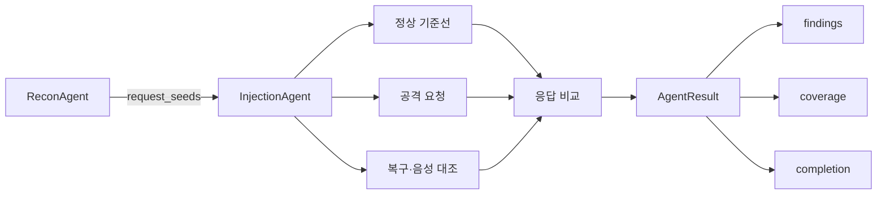

# Injection Subagent — 구현체

`dast-harness`에 통합되는 SQL Injection·OS Command Injection 탐지 에이전트
구현체다. 원래 별도 저장소([`1mhe2y0ung/Injection-subagent`](https://github.com/1mhe2y0ung/Injection-subagent))였던
것을, 설계 산출물을 담은 이 저장소(`.claude/agents/injection-agent.md`,
`.claude/skills/`) 안에 `dast-harness`가 기대하는 실제 배치 경로 그대로
옮겨왔다 — 아래 "파일 구성"의 경로가 곧 이 저장소 안 실제 위치다.

정찰 결과의 요청 씨앗을 안전하게 재생하고, 기준선과 공격·대조 응답을 비교해
확정 가능한 finding만 반환한다.

## 한눈에 보기

| 항목 | 내용 |
|---|---|
| 역할 | query/body 파라미터의 SQLi·Command Injection 검사 |
| 입력 | `ReconAgent`가 만든 `RequestSeed` 목록 |
| 출력 | 공통 계약을 따르는 `AgentResult`와 `AgentFinding` |
| HTTP 통로 | `AgentHttpClient`만 사용 |
| 검사 단위 | 파라미터 (`coverage.unit = "parameter"`) |
| 지원 본문 | URL-encoded form, JSON |
| 인증 | 기존 actor/session 사용 가능, 에이전트가 직접 로그인하지는 않음 |
| 안전 정책 | 스코프 검사, 리다이렉트 차단, 요청 예산 강제 |
| 외부 의존성 | 없음 — Python 표준 라이브러리와 `dast-harness`만 사용 |

> 이 파일들 자체는 독립 실행 패키지가 아니라 **`dast-harness` 통합용
> 산출물**이다. 이 저장소 안에서는 이미 `dast-harness`가 기대하는 상대
> 경로에 놓여 있으므로, 실제 `dast-harness` 저장소에 통합할 때는 아래 두
> 파일을 그 저장소 루트에 그대로 겹쳐 놓으면 된다.

## 파일 구성

| 파일 | 역할 | 이 저장소 안 위치 | `dast-harness` 배치 위치(동일 상대 경로) |
|---|---|---|---|
| `injection.py` | Injection 에이전트 구현 | `dast_harness/agent_kit/injection.py` | `dast_harness/agent_kit/injection.py` |
| `test_injection.py` | FakeClient 기반 단위·회귀 테스트 | `tests/test_injection.py` | `tests/test_injection.py` |

## 처리 흐름



한 번에 파라미터 하나만 바꾼다. method, 다른 query 파라미터, body의 다른 필드,
변경 대상 외 JSON 타입, Content-Type과 actor는 그대로 보존한다.

## 빠른 시작

### 1. 파일 통합

이 저장소의 두 파일을 `dast-harness` 저장소의 동일한 상대 경로에 복사하거나
병합한다.

```text
dast_harness/agent_kit/injection.py
    → dast-harness/dast_harness/agent_kit/injection.py

tests/test_injection.py
    → dast-harness/tests/test_injection.py
```

기존 파일이 있다면 덮어쓰기 전에 변경 내용을 비교한다.

### 2. 통제 취약 앱 실행

`dast-harness` 저장소 루트에서 실행한다.

```bash
python3 targets/vulnerable_app/app.py
```

### 3. Injection 에이전트 실행

다른 터미널에서 실행한다.

```bash
python3 -m dast_harness.agent_kit.injection http://127.0.0.1:8080
```

모듈 엔트리포인트는 `ReconAgent`를 먼저 실행한 뒤 발견된 query/body 파라미터를
검사한다.

| 통제 앱 경로 | 기대 결과 |
|---|---|
| `/search?q=` | SQLi finding 탐지 |
| `/lookup?q=` | finding 없음 — 의도적인 음성 대조군 |

## 코드에서 사용

```python
from dast_harness.agent_kit import AgentHttpClient
from dast_harness.agent_kit.injection import InjectionAgent
from dast_harness.agent_kit.recon import ReconAgent

base = "http://127.0.0.1:8080"
client = AgentHttpClient(allowlist=set(), max_requests=300)

recon_result = ReconAgent(client).run(base)
result = InjectionAgent(
    client,
    seeds=recon_result.request_seeds,
).run(base)

for finding in result.findings:
    print(finding.finding_id, finding.severity, finding.confidence)

print(result.coverage)
```

### 인증 actor 사용

기존 인증 세션이 들어 있는 actor를 사용할 수 있다.

```python
result = InjectionAgent(
    client,
    seeds=seeds,
    actor="alice",
).run(base)
```

| 조건 | 처리 |
|---|---|
| `auth_required=False` | 지정한 actor로 검사 |
| `auth_required=True`, 인증 actor 제공 | 기존 세션으로 검사 |
| `auth_required=True`, actor가 `anon` | `authentication-unavailable`로 건너뜀 |

에이전트가 로그인하거나 자격증명을 저장하지는 않는다. 인증 세션은 호출자가
`AgentHttpClient`에 미리 준비해야 한다.

## 지원 범위

### 요청 형식

| 파라미터 위치 | Method | Content-Type | 지원 여부 |
|---|---|---|---|
| query | GET | 본문 없음 | 지원 |
| query | POST | URL-encoded form | 지원 |
| query | POST | JSON | 지원 |
| body | POST | `application/x-www-form-urlencoded` | 지원 |
| body | POST | `application/json` | 지원 |
| body | POST | multipart 등 기타 형식 | 건너뜀 |
| path | 모든 형식 | 모든 형식 | 대상 아님 — IDOR 에이전트 담당 |
| JSON 배열 경로 | POST | JSON | 건너뜀 |

지원하지 않는 요청을 다른 형식으로 임의 변환하지 않는다. coverage의 `skipped`와
`skip_reasons`에 이유를 남긴다.

### 탐지 방식

| 종류 | 기준선 | 공격 | 대조 | finding 조건 |
|---|---|---|---|---|
| SQLi | 원래 값 | 값 + `'` | 값 + `'--` | 공격에서 DB 오류가 나타나고 대조가 기준선 상태로 복구 |
| CMDi | 원래 값 | 명령 구분자 + 셸 산술식 | 명령 구분자 제거 | 공격에서만 계산 결과 마커가 나타남 |

## SQL Injection 판정

SQLi 검사는 세 응답을 비교한다.

| 순서 | 요청 | 목적 |
|---|---|---|
| 1 | 정찰에서 관측한 원래 값 | 정상 기준선 확보 |
| 2 | 값 뒤에 홑따옴표(`'`) 추가 | SQL 구문 경계 파손 시도 |
| 3 | 값 뒤에 SQL 주석(`'--`) 추가 | 주석으로 구문이 복구되는지 확인 |

다음 조건을 모두 만족할 때만 `CONFIRMED` finding을 생성한다.

- 기준선 응답에는 DB 오류 문구가 없다.
- 공격 응답에는 알려진 DB 오류 문구가 있다.
- 대조 응답에는 DB 오류 문구가 없다.
- 대조 응답 상태가 기준선 상태로 돌아온다.

| 상황 | 판정 |
|---|---|
| 단순 HTTP 500 | finding 없음 |
| SQL처럼 보이는 오류 문구만 존재 | finding 없음 |
| 공격에서 SQL 오류 + 주석 대조로 복구 | `CONFIRMED` SQLi |
| 기준선부터 SQL 오류 문구 존재 | 비교 불가, finding 없음 |

## OS Command Injection 판정

`;`, `|`, backtick 뒤에 셸 산술식을 실행하는 비파괴 페이로드를 붙인다.
페이로드 원문에는 계산 결과가 없으므로, 결과 마커가 응답에 나타나면 셸이 실제로
식을 평가했다는 증거가 된다.

| 상황 | 판정 |
|---|---|
| 공격 문자열이 그대로 반사됨 | finding 없음 |
| 공격과 대조 모두 계산 결과를 포함 | 원인 확정 불가 |
| 공격에만 계산 결과 마커가 나타남 | `CONFIRMED` Command Injection |

## 안전 경계

| 보호 장치 | 동작 |
|---|---|
| 대상 허가 검사 | 매 요청마다 loopback 또는 명시적 allowlist인지 확인 |
| 리다이렉트 | 따라가지 않음 |
| 요청 예산 | `max_requests` 초과 시 중단하고 skip reason 기록 |
| 세션 격리 | actor별 쿠키 저장소 분리 |
| 증거 마스킹 | 자격증명 헤더 마스킹 |
| 응답 증거 크기 | excerpt 길이 제한 |

다음 공격은 안전상 실행하지 않는다.

| SQLi에서 보류 | Command Injection에서 보류 |
|---|---|
| UNION 기반 데이터 추출 | reverse shell |
| stacked query 쓰기 | 파일 읽기·쓰기 |
| time-based blind SQLi | 데이터 유출 |
| 실제 데이터 추출 | 지속성 확보 |
|  | 긴 sleep 기반 탐지 |
|  | OOB callback |

보류한 동작은 finding의 `Probe.withheld`에 기록한다.

## 결과 계약

| 필드 | 값 또는 의미 |
|---|---|
| `scanner` | `agent:injection` |
| `category` | `injection` |
| `severity` | 확인된 SQLi/CMDi는 `critical` |
| `confidence` | 대조가 성립한 finding은 `confirmed` |
| `matched_at` | 공격 요청 URL |
| `evidence` | 기준선·공격·대조 `HttpExchange`와 판정 근거 |
| `agent_data["injection"]` | 전략, 대상, 시도, 적중, 보류한 공격 |

### Coverage

| 필드 | 의미 |
|---|---|
| `unit` | `parameter` |
| `tested` | 검사를 끝낸 파라미터 수 |
| `skipped` | 판정할 수 없어 건너뛴 파라미터 수 |
| `skip_reasons` | 건너뛴 사유별 개수 |
| `findings` | 생성된 finding 수 |

요청 예산이 검사 중간에 끝난 현재 파라미터는 `tested`와 `skipped`에 중복 집계하지
않고 `skipped`로만 기록한다.

### Skip reason

| 사유 | 의미 |
|---|---|
| `missing-baseline-value` | 비교할 정상 값이 없음 |
| `unsupported-method` | GET/POST가 아닌 요청 |
| `unsupported-content-type` | 재생할 수 없는 본문 인코딩 |
| `unsupported-json-path` | 배열을 포함한 JSON 경로 |
| `authentication-unavailable` | 필요한 인증 세션이 없음 |
| `baseline-unavailable` | 기준선 요청 전송 실패 |
| `method-not-allowed` | 기준선 응답이 405 |
| `request-budget-exceeded` | 검사 도중 요청 예산 소진 |

## 테스트

`dast-harness`에 파일을 통합한 뒤 저장소 루트에서 실행한다.

```bash
# Injection 에이전트 테스트
python3 -m unittest tests.test_injection -v

# 전체 저장소 테스트
python3 -m unittest discover -s tests -v
```

### 테스트 범위

| 영역 | 검증 내용 |
|---|---|
| SQLi 양성 | `/search`에서 오류 + 주석 복구 탐지 |
| SQLi 음성 | `/lookup`과 복구되지 않는 SQL 오류의 오탐 방지 |
| CMDi 양성 | 셸 산술 결과 마커 탐지 |
| CMDi 음성 | 공격 문자열의 단순 반사 구별 |
| 요청 재생 | GET query, POST form, POST JSON의 다른 값 보존 |
| Coverage | tested/skipped와 요청 예산 집계 |
| 중복 억제 | 동일 seed의 finding 중복 방지 |
| 안전 | out-of-scope 요청 차단 확인 |

테스트는 실제 네트워크 대신 `FakeClient`를 사용하므로 서버나 스캐너 설치 없이
실행할 수 있다.

## 현재 제한사항

| 제한 | 영향 |
|---|---|
| error-based SQLi만 지원 | blind/time-based SQLi는 탐지하지 않음 |
| 응답 기반 CMDi만 지원 | 결과가 응답에 나타나지 않는 실행은 탐지하지 않음 |
| JSON 배열 경로 미지원 | `$.items[0].id` 같은 대상은 건너뜀 |
| POSIX 셸 문법 사용 | Windows CMD/PowerShell 전용 취약점은 탐지하지 못할 수 있음 |
| 로그인 기능 없음 | 호출자가 인증 세션을 준비해야 함 |
| CLI 자동 등록 없음 | 현재는 모듈 또는 Python API로 직접 실행 |

## 통합 체크리스트

- [ ] `injection.py`를 `dast_harness/agent_kit/`에 배치
- [ ] `test_injection.py`를 `tests/`에 배치
- [ ] `python3 -m unittest tests.test_injection -v` 통과
- [ ] `/search?q=` SQLi finding 확인
- [ ] `/lookup?q=` finding 없음 확인
- [ ] `AgentHttpClient` 외 HTTP 클라이언트를 사용하지 않는지 확인
- [ ] `dast_harness/safety.py`를 수정하지 않았는지 확인
- [ ] 전체 테스트 실행

프로젝트 전체 계약과 안전 규칙은 `dast-harness`의 `AGENT_GUIDE.md`와
`CLAUDE.md`를 따른다.
